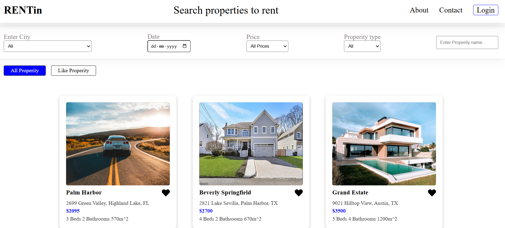
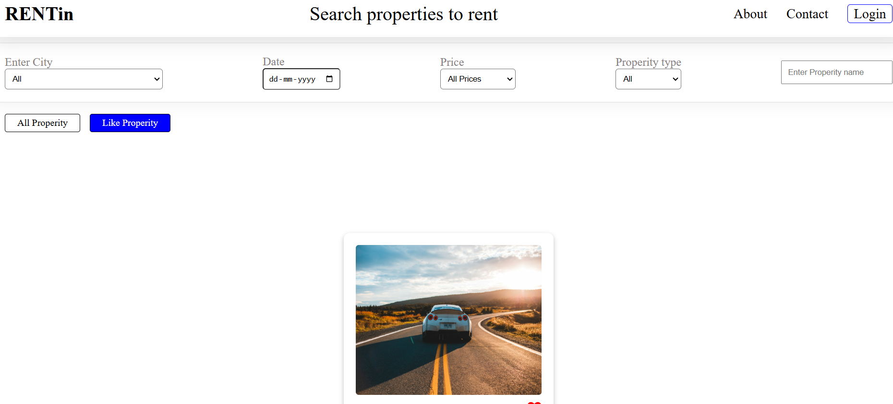

# 🏡 Rent a Property - Single Page Real Estate Web App

Welcome to **Rent a Property**, a single-page real estate web application built with **React**. This project allows users to filter properties based on multiple criteria and add properties to their **Favorites** for easy access.

## 🌍 Live Demo

🔗 Live Project [Click Here To acces the app](https://rentin-ten.vercel.app/)

---

## 🚀 Features

✅ **Multi-level Filtering** - Users can filter properties based on four different criteria to refine their search.

✅ **Favorites Page** - Users can add properties to their favorites and view them on a separate page.

✅ **Interactive UI** - Designed with a modern and responsive layout.

✅ **Efficient Component Communication** - Well-structured React components with effective **Parent-Child communication**.

✅ **Dummy Data Integration** - Displaying realistic property data for better user experience.

✅ **Seamless Navigation** - Single Page Application with smooth transitions and state management.

---

## 🛠 Tech Stack
 c Frontend: React
 ✅ State Management: useState

## 📸 Screenshots

### 🏡 Home Page

### ⭐ Favorites Page

## 📌 Future Improvements
🔹 Add a backend with real property data.
🔹 Implement user authentication.
🔹 Improve filtering logic with advanced search options.